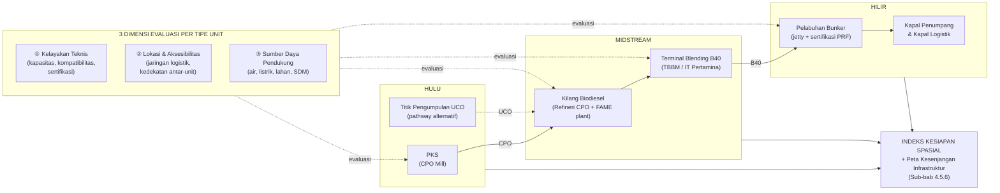

# 4.5 Infrastruktur Hulu–Midstream–Hilir

Sub-bab 4.1 hingga 4.4 telah membahas prinsip umum sistem distribusi, model desentralisasi rantai pasok biodiesel, pemilihan moda transportasi, serta kriteria kelayakan teknis dan ekonomi distribusi. Sub-bab 4.5 ini melanjutkan pembahasan tersebut dengan menekankan pada *aset fisik* yang menjadi prasyarat operasional implementasi mandat B40 di sektor maritim, yakni unit produksi, simpul logistik, dan jaringan penghubungnya yang tersebar di seluruh wilayah Indonesia. Berbeda dengan 4.2 yang berorientasi pada strategi (model multi-hub) dan 4.4 yang berorientasi pada kriteria kelayakan, fokus sub-bab ini adalah inventarisasi keberadaan aset eksisting beserta aksesibilitasnya, sebagai dasar empiris untuk menilai sejauh mana rantai pasok hulu–midstream–hilir telah siap menyalurkan B40 ke kapal penumpang dan kapal logistik di lima koridor maritim utama maupun di koridor-koridor pendukung lainnya. Pendekatan analitik dan definisi operasional kesiapan ditetapkan terlebih dahulu pada Sub-bab 4.5.1, sebelum pembahasan turun ke pemetaan tahap hulu (4.5.2), midstream (4.5.3), hilir (4.5.4), dan konektivitas antar-tahap (4.5.5), serta sintesis kesiapan dan peta kesenjangan spasial (4.5.6).

## 4.5.1 Pendekatan dan Cakupan Pemetaan Infrastruktur

Pemetaan infrastruktur pada sub-bab ini disusun mengikuti kerangka analitik *spatially-explicit pathway* yang diadaptasi dari Harahap et al. (2023) dalam studi rantai pasok bahan bakar terbarukan untuk pelayaran di Swedia. Dalam studi tersebut, model BeWhere digunakan untuk merepresentasikan rantai pasok bahan bakar terbarukan secara eksplisit secara geografis, dimulai dari sumber daya bahan baku (biomassa hutan, listrik terbarukan, dan CO₂ biogenik), unit konversi energi, hingga pelabuhan-pelabuhan permintaan, dengan jaringan jalan dan pelayaran sebagai penghubung antar-simpul (Harahap et al., 2023). Logika dasar tersebut, yakni penelusuran *resource–plant–demand* secara eksplisit pada peta, dipertahankan dalam pembahasan ini. Namun demikian, lapisan optimisasi techno-ekonomi (Mixed-Integer Linear Programming, MILP) yang menjadi inti BeWhere tidak diadopsi, karena kelayakan ekonomi dan dinamika harga karbon merupakan ranah Sub-bab 4.4 dan Bab 5. Sebagai gantinya, pemetaan dilakukan dalam mode *non-optimizing readiness assessment*, yaitu inventarisasi aset eksisting beserta atribut spasial-fisiknya untuk mengidentifikasi kesenjangan, suatu pendekatan yang lazim digunakan dalam analisis spasial multi-kriteria untuk perencanaan infrastruktur energi (Malczewski, 1999; Malczewski, 2006).

Pada setiap tahap rantai pasok B40 maritim — hulu, midstream, dan hilir — terdapat satu atau lebih *tipe unit infrastruktur* dengan karakteristik fisik dan operasional yang berbeda, sehingga kesiapan setiap tipe unit perlu dievaluasi secara terpisah. Untuk tahap hulu, unit utama adalah Pabrik Kelapa Sawit (PKS) sebagai konverter Tandan Buah Segar (TBS) menjadi Crude Palm Oil (CPO); pathway alternatif berbasis Used Cooking Oil (UCO) memerlukan tipe unit yang berbeda berupa titik pengumpulan dan pemurnian UCO. Untuk tahap midstream, unit yang dipertimbangkan adalah Kilang Biodiesel — yang umumnya terintegrasi antara refineri CPO dan unit transesterifikasi penghasil Fatty Acid Methyl Ester (FAME) — beserta Terminal Blending B40 yang melakukan pencampuran FAME dengan minyak Solar di TBBM atau Integrated Terminal Pertamina. Untuk tahap hilir, unit utamanya adalah Pelabuhan Bunker yang dilengkapi jetty dan sertifikasi *Port Reception Facility* (PRF), dengan TBBM/depot bunker sebagai unit pendukung penyimpanan dan distribusi-akhir. Enumerasi rinci seluruh tipe unit, termasuk varian skala dan integrasi vertikalnya, akan diuraikan pada Sub-bab 4.5.2 hingga 4.5.4.

Setiap tipe unit dievaluasi secara konsisten melalui tiga dimensi: (i) **Kelayakan Teknis**, mencakup skala kapasitas terpasang, kompatibilitas teknologi unit dengan persyaratan B40, dan status sertifikasi mutu/keberlanjutan yang relevan; (ii) **Lokasi dan Aksesibilitas**, yakni keterhubungan unit dengan jaringan logistik (jalan, pelabuhan, koridor pelayaran) serta kedekatannya dengan unit lain dalam rantai pasok; serta (iii) **Sumber Daya Pendukung**, mencakup ketersediaan air, listrik, lahan, dan tenaga kerja teknis pada lokasi unit. Dalam konteks 4.5, *kelayakan teknis* dibatasi pada kapabilitas aset fisik unit infrastruktur — tidak mencakup kelayakan finansial-ekonomi distribusi (ranah Sub-bab 4.4) maupun kompatibilitas mesin kapal terhadap B40 (ranah Sub-bab 3.3). Penetapan ketiga dimensi ini selaras dengan kebutuhan analisis dalam doc-skeleton Buku 2 sub-bab 4.5 (unit, lokasi, akses, sumber sumberdaya), dan tetap mempertahankan logika input data BeWhere yang membedakan *technological options*, *conversion facilities*, dan *demand* (Harahap et al., 2023). Diagram alir konseptual pendekatan ini disajikan pada Gambar 4.5.1.

**Gambar 4.5.1.** Diagram alir konseptual pemetaan infrastruktur B40 maritim Indonesia. Setiap tahap rantai pasok memuat satu atau beberapa tipe unit; setiap tipe unit dievaluasi melalui tiga dimensi yang konsisten (kelayakan teknis, lokasi & aksesibilitas, sumber daya pendukung). Adaptasi dari struktur model BeWhere (Harahap et al., 2023, Gambar 2) dengan penghapusan lapisan optimisasi MILP.

Sebagaimana ditunjukkan pada Gambar 4.5.1, alur analisis berjalan secara horizontal mengikuti aliran fisik bahan bakar dari hulu ke hilir, sementara tiga dimensi evaluasi diterapkan secara vertikal pada masing-masing tipe unit. Output yang ingin dihasilkan dari pendekatan ini bukan biaya minimum atau lokasi pabrik optimal sebagaimana pada Harahap et al. (2023), melainkan **indeks kesiapan spasial** dan **peta kesenjangan infrastruktur** yang disajikan pada Sub-bab 4.5.6. Indeks tersebut menjadi *handover* eksplisit ke Sub-bab 4.6 mengenai kebutuhan investasi dan kolaborasi sektor, serta menjadi rujukan analisis rantai pasok pada Bab 6 (Identifikasi Kegiatan Utama Model Bisnis) dan Bab 7 (Identifikasi Kepastian Sumber Daya Utama).

### Cakupan Geografis dan Batas Sistem

Pemetaan dilakukan pada skala nasional, mencakup seluruh wilayah Indonesia, dengan resolusi level provinsi untuk penyajian agregat dan resolusi level kabupaten/koordinat fasilitas untuk peta detail. Lima koridor maritim utama, yakni Tanjung Priok (Jakarta), Tanjung Perak (Surabaya), Belawan (Medan), Makassar, dan Bitung, ditetapkan sebagai fokus analisis hilir berdasarkan hierarki Rencana Induk Pelabuhan Nasional pada Keputusan Menteri Perhubungan No. KP 414 Tahun 2013 yang menempatkan kelimanya pada kategori Pelabuhan Utama. Empat di antaranya — Belawan, Tanjung Priok, Tanjung Perak, dan Makassar — juga termasuk dalam pelabuhan utama yang rutin diobservasi BPS untuk lalu lintas penumpang dan barang angkutan laut domestik (BPS, 2024); Bitung dipilih melengkapi keempatnya sebagai *gateway* koridor Indonesia Timur sesuai hierarki KP 414/2013, meskipun bukan kategori *top-traffic* dalam observasi rutin BPS. Selain itu, koridor pendukung di kawasan Indonesia Timur — antara lain Banjarmasin, Pontianak, Sorong, Ambon, Jayapura, Kupang, dan Tenau — turut dipetakan untuk menjamin kelengkapan analisis pada wilayah yang selama ini dilayani oleh program Tol Laut Kementerian Perhubungan dan secara historis menghadapi kesenjangan logistik energi. Batas sistem yang digunakan meliputi infrastruktur fisik *eksisting* dengan status operasional pada periode 2024–2026, serta proyek-proyek *committed* yang telah mencapai *Final Investment Decision* (FID); proyek konseptual atau dalam tahap studi pra-kelayakan dikecualikan, kecuali dirujuk sebagai konteks pipeline pembangunan.

Definisi "kesiapan infrastruktur" pada sub-bab ini dibatasi secara ketat pada keberadaan aset, kapasitas terpasang, akses logistik, dan ketersediaan sumber daya pendukung pada lokasi setiap tipe unit. Aspek yang berada di luar lingkup definisi kesiapan ini — yakni kelayakan finansial proyek (Sub-bab 4.4), kerangka regulasi dan insentif (Sub-bab 4.6), kompatibilitas teknis mesin kapal terhadap B40 (Sub-bab 3.3), serta dinamika harga pasar (Bab 5) — akan tetap dirujuk silang bila relevan, namun tidak menjadi parameter dalam penghitungan indeks kesiapan. Pembatasan ini dilakukan agar diagnosis kesenjangan yang dihasilkan oleh Sub-bab 4.5 berkarakter spasial dan asetik, sehingga dapat dipakai langsung untuk perumusan kebutuhan investasi dan kolaborasi sektor pada sub-bab berikutnya.

### Definisi Operasional Kesiapan Infrastruktur

Penilaian kesiapan disusun secara kuantitatif pada setiap kombinasi *tipe unit × dimensi evaluasi*, dengan tiga tingkat kategorisasi: *Siap*, *Sebagian Siap*, dan *Belum Siap*. Ambang nilai diturunkan dari tiga jenis basis: (i) **regulasi/kebijakan resmi** yang mengikat, seperti UU No. 22 Tahun 2009 tentang Lalu Lintas dan Angkutan Jalan, PP No. 61 Tahun 2009 tentang Kepelabuhanan, Permen PUPR No. 04/PRT/M/2015 tentang Kriteria dan Penetapan Wilayah Sungai, dan Kepmen ESDM No. 439.K/EK.01/MEM.E/2025 tentang Alokasi Biodiesel Tahun 2026; (ii) **konvensi/data industri** yang dipublikasikan oleh asosiasi profesi atau lembaga pemerintah, seperti data kapasitas terpasang APROBI dan klasifikasi PKS yang dirujuk Direktorat Jenderal Perkebunan; serta (iii) **judgment analitik** yang ditetapkan oleh penyusun ketika tidak ada referensi eksternal yang langsung relevan. Tabel 4.5.1 disusun dalam dua bagian: bagian A memuat indikator yang spesifik untuk masing-masing tipe unit, sedangkan bagian B memuat indikator *cross-cutting* yang berlaku pada lokasi setiap tipe unit di sepanjang koridor (jaringan jalan, armada angkutan antar-pulau, neraca air wilayah sungai, daya listrik, dan kapasitas sumber daya manusia teknis). Justifikasi rinci untuk setiap ambang yang berlabel "Judgment analitik" akan diuraikan pada sub-bab tahap terkait.

**Tabel 4.5.1.** Definisi Operasional Kesiapan Infrastruktur B40 Maritim per Tipe Unit dan Dimensi Evaluasi

*Bagian A — Indikator spesifik per tipe unit*

| Tahap | Tipe Unit | Dimensi Evaluasi | Indikator Kuantitatif | Siap | Sebagian Siap | Belum Siap | Basis Penetapan Ambang |
|---|---|---|---|---|---|---|---|
| **Hulu** | **PKS (CPO Mill)** | Kelayakan Teknis | Kapasitas pengolahan TBS (ton/jam) | ≥ 60 | 30 – < 60 | < 30 | Konvensi industri: BPPT mengklasifikasikan PKS *mini* pada 5–10 ton TBS/jam (BPPT, 2012); PKS standar komersial yang diadopsi luas adalah 30 ton TBS/jam (terkait Permentan No. 3 Tahun 2024 yang mensyaratkan minimal 6.000 ha kebun); skala besar 60+ ton TBS/jam dijumpai pada PTPN dan grup swasta besar (PTPN VI; Eagle High Plantations dalam *Sawit Indonesia*, 2018) |
|  |  | Lokasi & Aksesibilitas | Jarak ke jalan nasional/provinsi terdekat (km) | ≤ 5 | 5 – 15 | > 15 | Judgment analitik |
|  |  | Lokasi & Aksesibilitas | Jarak ke kilang biodiesel terdekat (km) | ≤ 100 | 100 – 300 | > 300 | Judgment analitik |
| **Midstream** | **Kilang Biodiesel** (terintegrasi refineri CPO + transesterifikasi/FAME) | Kelayakan Teknis | Kapasitas FAME terpasang (kL/tahun) | ≥ 500.000 | 200.000 – < 500.000 | < 200.000 | Data APROBI (2022, 2024): rerata kapasitas per perusahaan ~575.000 kL/tahun pada total 19,56 juta kL untuk 34 perusahaan; rentang fasilitas individu yang teridentifikasi 400.000–2.250.000 kL/tahun (APROBI dalam Bisnis.com, 2023; Kontan, 2025) |
|  |  | Kelayakan Teknis | Tingkat pemenuhan alokasi BBN tahunan terhadap kuota Kepmen ESDM 439.K/EK.01/MEM.E/2025 | ≥ 85% | 70% – < 85% | < 70% | Regulasi: Kepmen ESDM 439.K/EK.01/MEM.E/2025; ambang utilisasi 85% adalah batas atas operasional industri biodiesel (perawatan rutin) sebagaimana disampaikan Sekjen APROBI (Kontan, 2025) |
|  |  | Kelayakan Teknis | Status sertifikasi keberlanjutan (ISPO wajib + ISCC EU/ISCC Plus opsional) | ISPO + ≥ 1 ISCC | ISPO saja | Tidak bersertifikat | Regulasi ISPO wajib (Permentan No. 38 Tahun 2020); ISCC bersifat sukarela untuk akses pasar ekspor |
|  | **Terminal Blending B40** (TBBM / Integrated Terminal Pertamina) | Kelayakan Teknis | Kapasitas blending B40 terpasang (kL/tahun) | ≥ 500.000 | 100.000 – < 500.000 | < 100.000 atau tidak ada | Judgment analitik |
|  |  | Lokasi & Aksesibilitas | Jarak ke pelabuhan bunker terdekat (km) | ≤ 25 | 25 – 75 | > 75 | Judgment analitik |
| **Hilir** | **Pelabuhan Bunker** (jetty + sertifikasi PRF) | Kelayakan Teknis | Hierarki pelabuhan menurut PP 61/2009 dan KP 414/2013 | Pelabuhan Utama (PU) | Pelabuhan Pengumpul (PP) | Pelabuhan Pengumpan Regional/Lokal (PR/PL) | Regulasi: PP No. 61 Tahun 2009 tentang Kepelabuhanan; KP No. 414 Tahun 2013 tentang Rencana Induk Pelabuhan Nasional; PM Perhubungan No. 51 Tahun 2015 |
|  |  | Kelayakan Teknis | Ketersediaan B-series pada layanan bunkering eksisting | B40 tersedia | B30/B35 tersedia | Hanya HSD/MFO | Buku I, Tabel 4.4 (hlm. 69) |
|  |  | Kelayakan Teknis | Sertifikasi *Port Reception Facility* (PRF) | Bersertifikat aktif | Dalam proses | Tidak bersertifikat | Buku I, hlm. 69 (mengacu MARPOL Annex VI dan PM Perhubungan No. 29 Tahun 2021) |
|  |  | Kelayakan Teknis | Metode pengisian bahan bakar yang tersedia | ≥ 2 metode (mis. STS + shore-pipe) | 1 metode | Tidak ada layanan bunker | Buku I, Tabel 4.4; tipologi STS, shore-pipe, truck-to-ship, barge-to-ship merujuk SOLAS Chapter II-2 dan IMO IGF Code |

*Bagian B — Indikator cross-cutting (berlaku pada lokasi setiap tipe unit di sepanjang koridor)*

| Cakupan | Dimensi Evaluasi | Indikator Kuantitatif | Siap | Sebagian Siap | Belum Siap | Basis Penetapan Ambang |
|---|---|---|---|---|---|---|
| Berlaku pada lokasi seluruh tipe unit yang membutuhkan akses truk tangki | Lokasi & Aksesibilitas | Kelas jalan akses ke lokasi tipe unit (klasifikasi MST) | Jalan Kelas I (MST 10 ton) atau Kelas Khusus (MST > 10 ton) | Jalan Kelas II (MST 8 ton) | Jalan Kelas III (MST < 8 ton untuk kondisi tertentu) | Regulasi: UU No. 22 Tahun 2009 tentang LLAJ Pasal 19; PP No. 34 Tahun 2006 tentang Jalan; Permen PUPR No. 05/PRT/M/2018 |
| Berlaku pada koridor antar-pulau (kilang ke terminal blending atau ke pelabuhan bunker) | Lokasi & Aksesibilitas | Ketersediaan kapal tanker pengangkut FAME (DWT) di koridor | ≥ 1 unit ≥ 5.000 DWT | Hanya kapal < 5.000 DWT | Tidak ada armada terdedikasi | Judgment analitik |
| Berlaku pada lokasi PKS, kilang biodiesel, dan terminal blending | Sumber Daya Pendukung | Status neraca air WS pada lokasi tipe unit (Q ketersediaan − Q kebutuhan, agregasi tahunan) | Surplus pada seluruh bulan | Surplus pada ≥ 9 bulan, defisit musiman pada ≤ 3 bulan | Defisit pada > 3 bulan | Regulasi: Permen PUPR No. 04/PRT/M/2015 tentang Kriteria dan Penetapan WS; metodologi neraca air BBWS/BWS Kementerian PUPR (Q ketersediaan − Q kebutuhan) |
| Berlaku pada lokasi seluruh tipe unit | Sumber Daya Pendukung | Rasio daya tersambung PLN terhadap kebutuhan operasional tipe unit | ≥ 120% | 80% – < 120% | < 80% atau bergantung penuh pada pembangkit *captive* | Judgment analitik |
| Berlaku pada provinsi tempat tipe unit beroperasi | Sumber Daya Pendukung | Ketersediaan lembaga pelatihan/sertifikasi BNSP terkait BBN dan bunkering kapal | ≥ 2 lembaga terakreditasi | 1 lembaga | Tidak ada | Judgment analitik |

*Catatan: Pada Bagian A, sel kosong pada kolom Tahap dan Tipe Unit mengikuti baris di atasnya (kelompok yang sama). Pada saat dipindahkan ke tata letak Word/PDF, sel-sel tersebut dapat dimerge secara vertikal untuk merepresentasikan pengelompokan tahap dan tipe unit.*

## 4.5.2 Hulu — Sebaran Pabrik Kelapa Sawit dan Aksesibilitasnya

Pabrik Kelapa Sawit (PKS) menempati posisi hulu rantai pasok B40 sebagai unit yang mengonversi Tandan Buah Segar (TBS) menjadi Crude Palm Oil (CPO). Berdasarkan kompilasi BPS yang dirilis ulang pada 2024, terdapat 2.285 perusahaan perkebunan kelapa sawit yang tersebar di 29 provinsi, dengan konsentrasi 52,69% di Pulau Sumatra dan 42,71% di Pulau Kalimantan; lima provinsi terbesar adalah Kalimantan Barat (352 perusahaan), Sumatera Utara (327), Kalimantan Timur (268), Riau (228), dan Kalimantan Tengah (216) (BPS dalam GoodStats, 2025). Klasifikasi PKS menurut kapasitas pengolahan TBS yang dipakai pada Tabel 4.5.1 membedakan tiga kelas operasional: PKS *mini* 5–10 ton TBS/jam yang umumnya melayani kebun rakyat dan koperasi (BPPT, 2012; Induk KUD, 2019), PKS standar komersial 30 ton TBS/jam yang menjadi konfigurasi paling lazim di pasar mesin pengolahan dan selaras dengan ambang luas minimal kebun 6.000 hektar pada Permentan No. 3 Tahun 2024, serta PKS skala besar ≥60 ton TBS/jam yang dijumpai pada BUMN dan grup swasta. PTPN VI Pinang Tinggi, misalnya, menambah kapasitasnya dari 30 menjadi 60 ton TBS/jam pada 2001 (PTPN VI), sedangkan Eagle High Plantations mengoperasikan sembilan PKS dengan kapasitas total 2,85 juta ton TBS/tahun, termasuk PKS 60 ton TBS/jam di Keerom, Papua (Sawit Indonesia, 2018). Pemilihan tiga ambang tersebut (≥60, 30 hingga <60, dan <30 ton TBS/jam) merepresentasikan tiga tingkat keandalan pasokan CPO yang berbeda secara struktural pada bisnis model B40, mulai dari unit *anchor* yang dapat menopang volume kontrak besar hingga unit penopang dengan stabilitas pasokan yang lebih bergantung pada agregasi.

Aksesibilitas PKS terhadap jaringan jalan utama menjadi kriteria penting karena TBS memiliki jendela waktu pasca-panen yang sempit — pengolahan TBS yang melampaui 24 jam pasca-panen umumnya direkomendasikan dihindari karena memicu peningkatan kadar Asam Lemak Bebas (ALB) dan penurunan rendemen CPO. PKS umumnya berlokasi di tengah atau tepi kebun, dan terhubung ke jaringan jalan nasional/provinsi melalui jalan kebun dan jalan kabupaten yang kondisi perkerasannya bervariasi. Ambang jarak ≤5 kilometer pada Tabel 4.5.1 mewakili kondisi PKS yang berbatasan langsung dengan jaringan jalan utama melalui jalan kebun beraspal pendek, sehingga truk tangki CPO dan truk pengangkut pasokan logistik dapat beroperasi tanpa berbagi jalur jauh dengan lalu lintas publik; rentang 5–15 kilometer mewakili PKS yang mengandalkan jalan kabupaten beraspal sederhana, yang masih dapat dilalui truk berbobot menengah pada musim kering namun rawan terganggu pada musim penghujan. Jarak >15 kilometer ke jalan nasional/provinsi terdekat mengindikasikan ketergantungan pada jalan kabupaten yang umumnya tidak beraspal sempurna, dengan risiko mobilitas terbatas terutama pada wilayah pedalaman Kalimantan dan Papua, sehingga PKS pada kategori ini ditempatkan sebagai *Belum Siap* karena keandalan logistik truk-nya tidak dapat dijamin sepanjang tahun.

Distribusi PKS tidak selaras secara spasial dengan distribusi kilang biodiesel (BU BBN); kilang biodiesel terintegrasi cenderung terkonsentrasi di kompleks pelabuhan ekspor seperti Dumai dan Pelintung di Riau, Belawan di Sumatera Utara, Gresik di Jawa Timur, dengan beberapa fasilitas tambahan di Sumatera Selatan dan Kalimantan Timur (APROBI dalam Bisnis.com, 2023). Implikasi terhadap pengangkutan CPO dari PKS menuju kilang biodiesel adalah bahwa rute intra-koridor dengan jarak ≤100 kilometer dapat dilayani oleh truk tangki CPO dengan keandalan operasional dan biaya yang terjaga, sehingga ambang tersebut dipakai sebagai indikator *Siap* dalam Tabel 4.5.1; rute 100–300 kilometer masih layak dilayani oleh truk tangki namun mulai menghadapi peningkatan biaya bahan bakar, *opportunity cost* waktu transit, dan risiko kerusakan jalan, sehingga ditempatkan sebagai *Sebagian Siap*. Pada jarak >300 kilometer atau pada koridor antar-pulau, moda truk tangki menjadi tidak ekonomis dan rute harus beralih ke moda kapal atau *barge* yang memerlukan dukungan pelabuhan CPO *bulking* dan armada antar-pulau terdedikasi — kondisi ini ditempatkan sebagai *Belum Siap* dan secara implisit mengandung kebutuhan akan terminal CPO antar-pulau sebagai prasyarat tambahan.

Pola integrasi vertikal pada industri sawit Indonesia memengaruhi makna spasial dari kategorisasi di atas. Grup besar seperti Wilmar, Sinar Mas Agro Resources Tbk (SMART), Musim Mas, dan Permata Hijau Group umumnya mengoperasikan PKS dan kilang biodiesel dalam koridor logistik yang sama atau berdekatan, sehingga friksi pengangkutan CPO antar-unit dalam grup tersebut relatif minimal meskipun PKS-nya tersebar di banyak provinsi. Sebaliknya, PKS independen — termasuk PKS mini milik koperasi unit desa, PKS mandiri kelompok tani, dan sebagian PKS PTPN dengan kebun pola PIR — cenderung menjual CPO kepada pedagang perantara, dengan rute logistik yang lebih panjang dan harga yang berfluktuasi; pola ini analog dengan struktur tata niaga biofuel berbasis bahan baku terdesentralisasi yang dilaporkan pada studi rantai pasok UCO Indonesia, yang membedakan tiga model tata niaga (tanpa intervensi pemerintah, intervensi penuh, dan skema *offtaker* melalui Pertamina) dengan implikasi yang berbeda terhadap stabilitas pasokan (Sudaryadi et al., 2022). Kategorisasi pada Tabel 4.5.1 dengan demikian menangkap dua dimensi yang saling berinteraksi pada level hulu: skala dan keandalan unit pada PKS individu, dan friksi spasial yang menentukan biaya distribusi CPO menuju titik konversi B40. Pemetaan rinci kilang biodiesel dan terminal blending sebagai pasangan struktural PKS pada rantai pasok *midstream* diuraikan pada Sub-bab 4.5.3.

## 4.5.3 Midstream — Kilang Biodiesel dan Terminal Blending B40

Tahap *midstream* rantai pasok B40 diisi oleh dua tipe unit yang berurutan secara fungsional: Kilang Biodiesel yang mengkonversi CPO menjadi *Fatty Acid Methyl Ester* (FAME) melalui proses transesterifikasi pada fasilitas yang umumnya terintegrasi dengan refineri RBDPO, serta Terminal Blending B40 yang mencampur FAME dengan minyak Solar pada Terminal Bahan Bakar Minyak (TBBM) atau *Integrated Terminal* (IT) milik Pertamina Patra Niaga. Per November 2022, APROBI mencatat 32 perusahaan biodiesel berbasis sawit dengan kapasitas terpasang gabungan 17,14 juta kL dan nilai investasi US$1,78 miliar (Agrikan, 2022). Tiga ambang kapasitas FAME pada Tabel 4.5.1 (≥500.000, 200.000–<500.000, dan <200.000 kL/tahun) memetakan distribusi kapasitas yang sangat skewed dalam industri ini: pada kelas *Siap*, terdapat fasilitas-fasilitas anchor seperti PT Wilmar Nabati Indonesia di Gresik (2,25 juta kL), PT Wilmar Bioenergi Indonesia di Dumai, Riau (1,60 juta kL), PT Kutai Refinery Nusantara di Balikpapan, Kalimantan Timur (1,14 juta kL), PT Energi Unggul Persada di Kalimantan Timur (948.000 kL), PT Musim Mas di Batam, Kepulauan Riau (897.000 kL), PT Bayas Biofuels di Riau (862.000 kL), dan PT Sari Dumai Sejati di Riau (690.000 kL); pada kelas *Sebagian Siap*, fasilitas berskala 200.000–500.000 kL/tahun seperti PT Multimas Nabati Asahan di Banten (569.000 kL), PT Smart Tbk di Kalimantan Selatan (441.000 kL), PT Sinarmas Bio Energy di Jawa Barat (455.400 kL), PT Multi Nabati Sulawesi di Sulawesi Utara (476.000 kL), PT Permata Hijau Palm Oleo (417.000 kL), dan PT Tunas Baru Lampung (402.000 kL); sedangkan kelas *Belum Siap* mewakili fasilitas mini seperti PT Bali Hijau Biodiesel (360 kL/tahun) dan PT Sintong Abadi (35.000 kL/tahun). Implikasi penting bagi B40 maritim adalah bahwa fasilitas pada kelas *Siap* mampu mendukung kontrak pasokan jangka panjang dengan koridor maritim besar, sedangkan fasilitas pada dua kelas lainnya umumnya hanya layak melayani permintaan regional atau pasar non-PSO khusus.

Indikator pemenuhan alokasi BBN tahunan (≥85%, 70–<85%, <70% terhadap kuota Kepmen ESDM No. 439.K/EK.01/MEM.E/2025) menangkap gap eksekusi antara kapasitas teknis terpasang dan output yang benar-benar disalurkan ke BU BBM. Sekretaris Jenderal APROBI Ernest Gunawan menyatakan bahwa utilisasi 80–85% sudah merupakan batas atas operasional industri biodiesel karena setiap fasilitas memerlukan jendela perawatan rutin yang tidak dapat dihilangkan tanpa risiko keandalan jangka menengah (Kontan, 2025); ambang ≥85% pada kategori *Siap* dengan demikian mewakili kondisi pemenuhan alokasi yang konsisten dengan kapabilitas teknis tertinggi yang realistis, sedangkan rentang 70–85% menandai kinerja operasional yang masih dapat ditolerir namun mengindikasikan friksi pemeliharaan, suplai CPO, atau logistik distribusi yang belum sepenuhnya stabil. Kinerja <70% dimasukkan sebagai *Belum Siap* karena pada level tersebut kontrak pasokan B40 ke kapal akan menghadapi risiko *delivered-volume shortfall* yang material. Selanjutnya, indikator sertifikasi keberlanjutan menempatkan ISPO (wajib menurut Permentan No. 38 Tahun 2020) sebagai prasyarat dasar dan ISCC EU/ISCC Plus sebagai *value add* opsional; kombinasi ISPO bersama setidaknya satu ISCC ditempatkan di kategori *Siap* karena membuka akses ke pasar ekspor regulated dan ke kontrak *bunker* internasional yang sebagian sudah mensyaratkan jejak keberlanjutan terverifikasi, sedangkan ISPO saja ditempatkan di *Sebagian Siap* karena hanya memenuhi syarat domestik. Tidak adanya sertifikasi sama sekali ditempatkan pada *Belum Siap* karena fasilitas tersebut tidak memenuhi kewajiban regulatif dan mengandung risiko operasional yang signifikan terhadap kelangsungan alokasi BBN.

Terminal Blending B40 di Indonesia secara struktural identik dengan jaringan TBBM/IT yang dioperasikan Pertamina Patra Niaga, yang merupakan satu-satunya entitas berskala nasional yang mengoperasikan blending unit B40 pada *fuel terminal* yang sama dengan *fuel terminal* HSD/MFO. Jaringan TBBM Pertamina Patra Niaga mencakup lebih dari 100 terminal di seluruh Indonesia, dengan simpul utama di Sumatra (Krueng Raya Aceh, Lhokseumawe, Belawan, Dumai, Plaju–Kertapati, Panjang Bandar Lampung), Jawa (Tanjung Priok, Plumpang, Tanjung Gerem, Cikampek, Balongan, Cilacap, Tanjung Wangi, Tanjung Perak), Kalimantan (Pontianak, Banjarmasin, Balikpapan, Samarinda, Tarakan), serta Sulawesi dan Indonesia Timur (Makassar, Manado–Bitung, Ambon, Sorong) (Pertamina Patra Niaga, n.d.). *Integrated Terminal* (IT) Jakarta — gabungan Fuel Terminal Plumpang, Fuel Terminal Tanjung Priok, dan LPG Terminal Tanjung Priok — sendiri menyumbang 17–20% pemenuhan BBM nasional dan melayani lebih dari 120 lembaga penyalur (Republika, 2026); kapasitas tangki timbun TBBM Plumpang saja tercatat 291.889 kL (RRI, 2023). Tiga ambang kapasitas *blending* B40 (≥500.000, 100.000–<500.000, dan <100.000 kL/tahun atau tidak ada) ditetapkan dengan logika bahwa terminal yang mampu melayani satu provinsi besar — misalnya DKI Jakarta, Jawa Timur, atau Sumatera Utara — memerlukan throughput minimal sekitar 500.000 kL/tahun, sedangkan terminal regional skala provinsi kecil di kisaran 100.000–500.000 kL/tahun. Selanjutnya, indikator jarak terminal blending ke pelabuhan bunker terdekat (≤25, 25–75, >75 km) merefleksikan jarak operasional pipa BBM antar-fasilitas Pertamina yang lazim ditemui di kompleks pelabuhan utama; jarak Plumpang–Tanjung Priok yang hanya beberapa kilometer dan integrasi mereka dalam IT Jakarta yang sama mewakili kondisi *Siap* secara struktural, sedangkan rentang 25–75 km mewakili konfigurasi terminal-pelabuhan dalam dua zona industri yang berbeda namun masih tersambung dengan pipa atau truk tangki pendek, dan jarak >75 km mengindikasikan ketergantungan pada moda truk tangki antar kota dengan friksi waktu transit dan biaya bahan bakar yang sudah material.

Pola spasial gabungan kilang biodiesel dan terminal blending menunjukkan dua kelompok koridor yang struktur kesiapannya kontras. Koridor pertama, yang mencakup Riau (Dumai–Pelintung), Sumatera Utara (Belawan–Medan), Kepulauan Riau (Batam), Jawa Timur (Gresik–Tanjung Perak), DKI Jakarta (Plumpang–Tanjung Priok), dan Kalimantan Timur (Balikpapan–Kariangau), menampilkan kombinasi kilang biodiesel kelas *Siap* dengan IT/TBBM Pertamina Patra Niaga skala besar dan pelabuhan utama dalam radius pendek; koridor ini secara struktural sudah mendukung implementasi B40 maritim dengan friksi logistik yang minimal. Koridor kedua, yang mencakup sebagian Sulawesi Utara (Bitung), Lampung, Banten, dan koridor Indonesia Timur, memiliki kilang biodiesel pada kelas *Sebagian Siap* atau ketergantungan pada pengiriman antar-pulau dari koridor pertama; pada koridor ini, kapal pengangkut B40 inter-island menjadi mata rantai kritis yang akan dibahas pada Sub-bab 4.5.5. Hubungan struktural antara kilang biodiesel dan Pertamina Patra Niaga sebagai *single integrator midstream* menggemakan konfigurasi yang dilaporkan untuk *carrier* energi lain di Indonesia — pada model bisnis amonia dan hidrogen, Pertamina dan klaster industri eksisting (Bontang, Gresik, Lhokseumawe, Cilegon) berfungsi sebagai *anchor* infrastruktur yang menyatukan produksi terdistribusi dengan distribusi nasional (Kementerian ESDM, 2023; Kementerian ESDM, 2025). Pada B40, peran tersebut dipegang Pertamina Patra Niaga melalui jaringan IT/TBBM, dengan implikasi bahwa kesiapan hilir bunker maritim — yang dibahas pada Sub-bab 4.5.4 — secara langsung tergantung pada apakah lokasi pelabuhan bunker target dilayani oleh IT/TBBM yang sudah memiliki blending B40 aktif atau hanya menerima pasokan B40 jadi dari terminal lain.

## 4.5.4 Hilir — Pelabuhan Bunker dan Distribusi-Akhir B40 Maritim

Tahap hilir rantai pasok B40 maritim diisi oleh Pelabuhan Bunker, yakni pelabuhan yang dilengkapi *jetty* khusus pengisian bahan bakar, sertifikasi *Port Reception Facility* (PRF), dan SOP bunkering yang memenuhi SOLAS Chapter II-2, IMO IGF Code, serta Surat Edaran Direktorat Jenderal Perhubungan Laut tentang pengawasan pengisian BBM kapal (Buku I, Tabel 4.4 dan hlm. 69–70). Tabel 4.5.1 menggunakan hierarki pelabuhan menurut PP No. 61 Tahun 2009 tentang Kepelabuhanan dan KP No. 414 Tahun 2013 tentang Rencana Induk Pelabuhan Nasional sebagai indikator skala — Pelabuhan Utama (PU) di kategori *Siap*, Pelabuhan Pengumpul (PP) di *Sebagian Siap*, dan Pelabuhan Pengumpan Regional/Lokal (PR/PL) di *Belum Siap*. Justifikasi pemetaan ini bukan terletak pada hierarki itu sendiri sebagai kapabilitas teknis, melainkan pada korelasi struktural antara hierarki dengan volume *call* kapal komersial dan keberadaan IT/TBBM Pertamina Patra Niaga di kompleks pelabuhan tersebut. Pelabuhan Utama Tanjung Priok, Tanjung Perak, Belawan, Makassar, dan Bitung telah secara eksplisit dicatat dalam Buku I (Tabel 4.4) sebagai lokasi bunkering MFO/HSD/MGO, sehingga modifikasi terbatas untuk akomodasi B40 dapat dilakukan pada kompleks bunkering eksistingnya. Pelabuhan Pengumpul, yang umumnya melayani trafik regional dengan volume call yang lebih moderat, secara umum membutuhkan investasi tambahan untuk *jetty* khusus bunkering yang dilengkapi *flame arrestor* dan *emergency shut-off valve* sebagaimana disyaratkan dalam pedoman fasilitas penunjang bunkering, sementara Pelabuhan Pengumpan Regional/Lokal yang menjadi simpul Tol Laut umumnya hanya memiliki dermaga umum tanpa instalasi bunker terdedikasi.

Indikator ketersediaan B-series (B40 / B30–B35 / hanya HSD–MFO) menangkap progres diferensial implementasi mandat biodiesel di sisi maritim. Berdasarkan dokumentasi resmi yang tersedia, distribusi biodiesel B30 hingga B35 di pelabuhan-pelabuhan milik negara dan BUMN telah berjalan melalui saluran pipa Pertamina (Buku I, Tabel 4.4); status ini mencerminkan implementasi mandat B30 yang efektif sejak 2020 dan B35 sejak Februari 2023. Mandat B40 sendiri efektif untuk seluruh sektor sejak Januari 2025, dan rancangan kenaikan ke B50 diumumkan pada April 2026 dengan target operasional Juli 2026, dengan uji jalan B50 yang dimulai pada Agustus 2025 mencakup berbagai jenis kendaraan termasuk kapal (Asatu News, 2026). Dalam jendela waktu antara mandat B40 nasional dan rampungnya uji jalan kompatibilitas mesin kapal, sebagian besar pelabuhan bunker di Indonesia secara realistis berada pada kategori *Sebagian Siap* — yakni masih menyalurkan B30/B35 sebagai produk sehari-hari, dengan transisi ke B40 yang berlangsung bertahap mengikuti rotasi stok dan sertifikasi mutu di IT/TBBM upstream. Kategori *Siap* (B40 tersedia secara rutin sebagai produk maritim) saat ini terbatas pada pelabuhan yang dilayani langsung oleh IT/TBBM yang sudah memiliki *blending* B40 aktif; kategori *Belum Siap* (hanya HSD/MFO) lazimnya berlaku pada pelabuhan PR/PL di kawasan Tol Laut Indonesia Timur yang masih menerima distribusi BBM via kapal *coastal* tanpa *bunker* khusus B-series.

Indikator sertifikasi *Port Reception Facility* (PRF) dan ketersediaan metode pengisian merupakan dua dimensi keandalan operasional bunker yang saling melengkapi. PRF disyaratkan oleh MARPOL Annex VI dan ditetapkan secara nasional melalui PM Perhubungan No. 29 Tahun 2021 tentang Standar Keselamatan Kapal; fungsinya adalah menerima limbah berminyak dan residu bahan bakar dari kapal sebelum pengisian bahan bakar baru, suatu prosedur yang menjadi kritis untuk pengisian biodiesel mengingat sifat FAME yang lebih reaktif terhadap kontaminan dan air dibandingkan HSD murni (Buku I, hlm. 69). Pelabuhan dengan PRF bersertifikat aktif ditempatkan pada kategori *Siap*, pelabuhan dengan PRF dalam proses sertifikasi pada *Sebagian Siap*, dan pelabuhan tanpa PRF pada *Belum Siap* — bukan karena kapal tidak dapat mengisi B40 tanpa PRF, melainkan karena tanpa fasilitas penampung limbah yang bersertifikat, risiko kontaminasi *bunker tank* kapal pasca-pengisian B40 secara signifikan lebih tinggi, dengan implikasi terhadap performa mesin yang terkait pula dengan pembahasan Sub-bab 3.3 Buku II ini. Indikator metode pengisian (≥2 metode / 1 metode / tidak ada layanan bunker) memetakan ketersediaan moda STS (*ship-to-ship*), *shore-pipe*, *truck-to-ship*, dan *barge-to-ship* yang dapat dirujuk pada Buku I, Tabel 4.4 dengan tipologi bunker yang sejalan SOLAS Chapter II-2 dan IMO IGF Code. Pelabuhan dengan ≥2 metode lebih tahan terhadap konflik penjadwalan kapal, gangguan cuaca, dan kebutuhan kontingensi operasional — kondisi yang penting untuk operasi penumpang dan logistik *all-year-round* — sehingga ditempatkan pada *Siap*; pelabuhan dengan satu metode tunggal cenderung mengalami *bottleneck* pada periode permintaan puncak seperti angkutan Lebaran dan Nataru, dan ditempatkan pada *Sebagian Siap*.

Pola permintaan B40 maritim domestik sangat ditentukan oleh dua operator BUMN: PT PELNI yang mengoperasikan 25 kapal penumpang dan 30 kapal perintis dengan menyinggahi 74 pelabuhan dalam jaringan reguler dan 230 pelabuhan dalam jaringan perintis (PELNI, 2025), serta PT ASDP Indonesia Ferry yang mengoperasikan lebih dari 226 unit kapal *roll-on/roll-off* yang melayani 307 lintasan dan 36 pelabuhan penyeberangan di seluruh Indonesia, dengan total produksi penumpang sebesar 6,12 juta orang pada 2024 (ASDP, n.d.; ASDP, 2025). Lima Pelabuhan Utama yang sekaligus menjadi pelabuhan strategis PELNI dan ASDP — Tanjung Priok, Tanjung Perak, Belawan, Makassar, dan Bitung — secara struktural sudah berkategori *Siap* untuk indikator hierarki dan akan menjadi *Siap* penuh apabila ketersediaan B40 dan PRF aktif terverifikasi. Sebaliknya, jaringan pelabuhan perintis PELNI di Indonesia Timur (Maluku, Papua, NTT) — yang dilayani kapal-kapal seperti KM Tatamailau dengan rute Bitung–Sorong–Merauke (Sering Jalan, 2026) — secara historis hanya menerima HSD/MFO via distribusi *coastal*, dengan rasio implementasi PRF dan blending B-series yang masih rendah; pelabuhan-pelabuhan ini akan tetap berada pada kategori *Belum Siap* atau *Sebagian Siap* hingga investasi terdedikasi dilakukan. Implikasi bagi model bisnis B40 maritim adalah bahwa adopsi awal akan terkonsentrasi pada koridor yang dilayani PELNI ekonomi dan ASDP penyeberangan jarak menengah dengan trayek tetap, sementara koridor perintis Tol Laut akan memerlukan dukungan investasi infrastruktur hilir yang lebih intensif. Mata rantai kritis yang menghubungkan kesiapan *midstream* di lokasi terkonsentrasi dengan kebutuhan permintaan yang tersebar di seluruh Nusantara, yakni armada kapal tanker pengangkut FAME dan B40 antar-pulau, dibahas pada Sub-bab 4.5.5.

## 4.5.5 Konektivitas Antar-Tahap (Multi-Moda Darat dan Laut)

Konektivitas antar-tipe unit pada rantai pasok B40 maritim bergantung pada dua moda yang saling melengkapi, yakni jalan untuk truk tangki dan jalur pelayaran inter-pulau untuk kapal tanker. Ambang kelas jalan pada Tabel 4.5.1 mengikuti UU No. 22 Tahun 2009 tentang Lalu Lintas dan Angkutan Jalan Pasal 19, PP No. 34 Tahun 2006 tentang Jalan, dan Permen PUPR No. 05/PRT/M/2018 yang mengatur klasifikasi kelas jalan berdasarkan Muatan Sumbu Terberat (MST). Jalan Kelas I dengan MST 10 ton dan Jalan Kelas Khusus dengan MST > 10 ton ditempatkan pada kategori *Siap* karena hanya kelas inilah yang dapat dilalui truk tangki BBM dengan beban penuh — truk tangki CPO dengan kapasitas 16 kiloliter dan truk tangki BBM standar Pertamina umumnya beroperasi dengan beban gandar yang membutuhkan jalan Kelas I sebagai prasyarat keandalan rute sepanjang tahun. Jalan Kelas II dengan MST 8 ton ditempatkan pada *Sebagian Siap* karena masih dapat dilalui truk tangki dengan pembatasan beban atau dengan operasi dua tahap menggunakan kendaraan transit; sedangkan Jalan Kelas III dengan MST < 8 ton untuk kondisi tertentu ditempatkan pada *Belum Siap* karena hanya dapat dilewati truk tangki kecil yang tidak ekonomis untuk volume distribusi B40 reguler dan rentan membatasi keandalan pengiriman pada musim penghujan. Indikator ini berlaku pada lokasi seluruh tipe unit yang membutuhkan akses truk tangki — yakni di sekitar PKS, kilang biodiesel, terminal blending, dan pelabuhan bunker — sehingga ketidaksesuaian satu segmen jalan saja dapat memutus keandalan rantai pasok di koridor terkait.

Konektivitas laut antar-pulau, yang menjadi kritis untuk koridor lintas-pulau yang tidak dapat dilayani truk tangki, ditangkap melalui indikator ketersediaan kapal tanker pengangkut FAME dengan ambang ≥1 unit ≥5.000 DWT untuk *Siap*, hanya kapal <5.000 DWT untuk *Sebagian Siap*, dan tidak ada armada terdedikasi untuk *Belum Siap*. PT Pertamina International Shipping (PIS) sebagai *single integrator logistic* energi nasional saat ini mengoperasikan 110 kapal milik dan total 750 kapal termasuk armada sewaan, dengan distribusi 161 miliar liter BBM dan LPG pada 2024 dan target ekspansi pada 2025 (PIS dalam Liputan6, 2026). Klasifikasi internal Pertamina membagi armada tanker ke dalam sepuluh tier berdasarkan DWT, mulai dari *Lighter & Small Tanker* (≤1.249 DWT) hingga ULCC (≥300.000 DWT) (Pertamina One Solution, n.d.). Ambang 5.000 DWT pada Tabel 4.5.1 dipilih dengan pertimbangan bahwa kapal pada kelas ini umumnya mampu melintasi koridor lintas-pulau utama Sumatera–Jawa, Jawa–Kalimantan, dan Jawa–Sulawesi tanpa pembatasan kedalaman pelabuhan yang signifikan, sementara kapal di bawah ambang tersebut umumnya hanya dioptimalkan untuk distribusi *coastal* jarak pendek. Sebagai ilustrasi konkret, dua *small tanker* terbaru PIS — PIS Rokan dan PIS Natuna, masing-masing 4.990 DWT — secara eksplisit di-*deploy* untuk memperkuat distribusi BBM domestik di Indonesia Timur (Nusa Tenggara, Maluku, Papua) (Investor.id, 2024; Kompas Money, 2024), pola yang mengonfirmasi bahwa koridor permintaan terdistribusi memang dilayani oleh kapal kelas <5.000 DWT yang frekuensi *call*-nya lebih tinggi tetapi volume per *call* lebih rendah, sehingga koridor tersebut secara struktural berada pada *Sebagian Siap* untuk indikator armada.

Implikasi gabungan kedua indikator konektivitas terhadap kesiapan rantai pasok B40 dapat dipetakan sepanjang struktur koridor yang sudah dijelaskan pada Sub-bab 4.5.2 hingga 4.5.4. Koridor utama Sumatra (Riau–Sumatera Utara), Jawa (DKI Jakarta–Jawa Timur), dan Kalimantan Timur menampilkan kombinasi Jalan Kelas I/Khusus pada akses ke kompleks PKS-kilang-pelabuhan utama serta armada tanker PIS kelas General Purpose (6.500–16.499 DWT) dan kelas yang lebih besar pada koridor inter-pulau, sehingga secara struktural berkategori *Siap* untuk kedua indikator konektivitas. Koridor Indonesia Timur — yang dilayani PELNI perintis dan kapal *small tanker* PIS seperti Rokan dan Natuna — berkategori *Sebagian Siap* karena armada inter-pulau yang tersedia masih dominan di kelas <5.000 DWT, dengan implikasi langsung terhadap volume B40 yang dapat dikirim per *trip* dan terhadap stabilitas pasokan pada periode permintaan puncak. Koridor pendalaman Kalimantan dan Papua, yang sebagian akses jalannya hanya berkelas Kelas III dengan MST < 8 ton dan tidak terlayani trayek tanker reguler, berkategori *Belum Siap* untuk kedua indikator dan akan memerlukan investasi multimoda terkoordinasi sebagai prasyarat partisipasi dalam pasar B40 maritim.

Visualisasi gabungan jaringan jalan nasional dan koridor laut yang melayani rantai pasok B40 disajikan pada Gambar 4.5.2, yang menampilkan empat lapis informasi spasial pada satu peta nasional. Lapis pertama adalah jaringan jalan nasional Kelas I/Khusus yang menghubungkan klaster PKS dengan kilang biodiesel dan terminal blending — meliputi koridor Trans-Sumatera (Banda Aceh–Belawan–Pekanbaru–Palembang–Lampung), Trans-Jawa (Tanjung Priok–Cilacap–Tanjung Perak–Banyuwangi), Trans-Kalimantan koridor selatan (Pontianak–Banjarmasin–Balikpapan), dan Trans-Sulawesi (Makassar–Pantoloan–Manado/Bitung); jalur Kelas II yang berfungsi sebagai koridor sekunder ditampilkan dengan garis putus-putus, mencakup Pan-Borneo koridor utara dan Trans-Papua yang masih terbatas. Lapis kedua adalah lima Pelabuhan Utama bunker — Tanjung Priok, Tanjung Perak, Belawan, Makassar, dan Bitung — yang sudah dikonfirmasi pada Buku I Tabel 4.4 (Buku I, hlm. 69) sebagai simpul hilir prioritas. Lapis ketiga adalah klaster kilang biodiesel anchor sesuai inventarisasi pada Sub-bab 4.5.3 (Dumai/Pelintung, Gresik, Balikpapan, Plaju, dan Batam) yang berfungsi sebagai titik konversi CPO → FAME, bersama dengan simpul IT/TBBM Pertamina Patra Niaga di lima Pelabuhan Utama. Lapis keempat adalah dua kelas koridor laut: koridor utama BBM (garis merah putus-putus) yang dilayani armada PIS antar lima Pelabuhan Utama, dan koridor Tol Laut Kementerian Perhubungan bersama trayek perintis PELNI (garis emas putus-putus) yang menyentuh Sorong, Jayapura, Ambon, Kupang, dan Merauke (PELNI, 2025; Direktorat Jenderal Perhubungan Laut, KP No. 414 Tahun 2013). Peta ini menegaskan dua pola spasial yang sudah dijelaskan: pertama, koridor utama Sumatera–Jawa–Kalimantan Timur menampilkan kerapatan gabungan jalan Kelas I, Pelabuhan Utama, dan IT Pertamina Patra Niaga sehingga rantai pasok dapat berjalan dengan kombinasi truk tangki dan kapal tanker GP/MR; kedua, koridor Indonesia Timur (Sulawesi Utara, Maluku, Papua, NTT) bergantung dominan pada koridor laut yang dilayani kapal *small tanker* kelas <5.000 DWT dan trayek perintis PELNI, dengan jaringan jalan pulau yang lebih terbatas. Sumber data peta meliputi Direktorat Jenderal Bina Marga Kementerian PUPR untuk klasifikasi jalan, Direktorat Jenderal Perhubungan Laut untuk Rencana Induk Pelabuhan Nasional dan koridor Tol Laut, serta Pertamina Patra Niaga dan PT Pertamina International Shipping untuk rute distribusi BBM antar-pulau; peta bersifat skematik dan bukan representasi geografis presisi. Konsolidasi temuan dari empat tahap rantai pasok di atas — yakni hulu (4.5.2), midstream (4.5.3), hilir (4.5.4), dan konektivitas (4.5.5) — ke dalam indeks kesiapan provinsi dan peta kesenjangan per koridor maritim disajikan pada Sub-bab 4.5.6.

**Gambar 4.5.2.** Peta Nasional Konektivitas Multi-Moda Rantai Pasok B40 Maritim Indonesia. *Basemap*: Natural Earth 1:10m (lisensi *public domain*). Choropleth provinsi sentra produksi sawit (4 sentra utama, 3 sentra pendukung) berdasarkan Kementerian Pertanian, *Outlook Komoditas Kelapa Sawit 2024*. Lokasi fasilitas: Pelabuhan Utama (KP No. 414 Tahun 2013), kilang biodiesel (APROBI 2024 via Bisnis.com 2023, Agrikan 2022), IT/TBBM (Pertamina Patra Niaga). Koridor laut digambar sebagai *great-circle* antar pasangan pelabuhan (skematik, bukan rute AIS aktual; Tol Laut dan trayek KM Tatamailau merujuk PELNI 2025 dan Sering Jalan 2026). Koridor jalan adalah polilini skematik antar simpul fasilitas, bukan geometri OSM/PUPR aktual; klasifikasi MST per UU 22/2009, PP 34/2006, dan Permen PUPR 05/2018.

---

## 4.5.6 Sintesis: Indeks Kesiapan dan Peta Kesenjangan Infrastruktur Spasial

Sub-bab 4.5.6 ini mengonsolidasikan temuan empat sub-bab sebelumnya — sebaran PKS pada 4.5.2, kilang biodiesel dan terminal blending pada 4.5.3, Pelabuhan Utama bunker pada 4.5.4, dan konektivitas multimoda pada 4.5.5 — ke dalam dua bentuk sintesis spasial yang dapat dibaca langsung untuk perumusan kebutuhan investasi pada Sub-bab 4.6. Sintesis pertama berbentuk *gap map* pada level provinsi yang mengklasifikasikan provinsi-provinsi Indonesia menjadi tiga kelompok kesiapan rantai pasok B40 maritim (Siap, Sebagian Siap, Belum Siap) berbasis lima kriteria yang sudah dimasukkan pada Tabel 4.5.1 — yakni keberadaan sentra produksi PKS, kapasitas kilang biodiesel BU BBN, IT/blending Pertamina, hierarki Pelabuhan Utama bunker, dan kelas konektivitas jalan-tanker. Sintesis kedua berbentuk profil multidimensi per koridor maritim utama yang membandingkan posisi relatif kelima Pelabuhan Utama (Belawan, Tanjung Priok, Tanjung Perak, Makassar, Bitung) pada lima dimensi rantai pasok yang sama, sehingga kelemahan dan keunggulan tiap koridor dapat diidentifikasi secara visual. Kedua sintesis ini bersifat indikatif/kualitatif — tujuannya adalah memetakan *kesenjangan* sebagai dasar prioritas kebijakan, bukan memberi peringkat numerik definitif antar wilayah. Sebagaimana dijanjikan pada 4.5.1, *handover* dari sub-bab ini menuju 4.6 (Investasi & Kolaborasi) dilakukan melalui dua produk konkret: peta indeks kesiapan provinsi (Gambar 4.5.3) dan profil koridor (Gambar 4.5.4), didukung tabel ringkasan gap per koridor (Tabel 4.5.2).

Gambar 4.5.3 menyajikan klasifikasi tiga tingkat kesiapan rantai pasok B40 maritim per provinsi, yang menampilkan tiga pola spasial konsisten dengan temuan Sub-bab 4.5.2–4.5.5. Pertama, hanya lima provinsi yang masuk kategori *Siap*, yakni Sumatera Utara (Belawan PU + kilang Wilmar/Permata Hijau Belawan + sentra utama PKS), Riau (Wilmar Bioenergi Dumai-Pelintung + sentra utama PKS), Jakarta Raya (Tanjung Priok PU + IT Plumpang sebagai blending hub terbesar nasional), Jawa Timur (Tanjung Perak PU + Wilmar Nabati Indro Gresik + IT Surabaya), dan Kalimantan Timur (Kutai Refinery Kariangau + sentra pendukung PKS + akses Balikpapan). Pola yang muncul jelas: kesiapan rantai pasok B40 maritim saat ini terkonsentrasi pada koridor Selat Malaka–Laut Jawa, mengikuti distribusi historis kilang biodiesel dan Pelabuhan Utama. Kedua, sembilan provinsi masuk kategori *Sebagian Siap* karena defisit pada salah satu atau dua tahap rantai pasok — termasuk Kalimantan Tengah dan Kalimantan Barat (sentra utama PKS tetapi tanpa kilang biodiesel atau Pelabuhan Utama lokal), Sumatera Selatan (Pertamina KPI Plaju sebagai *blending point* B40 sejak Januari 2025 tetapi tanpa BU BBN lokal), serta Sulawesi Selatan dan Sulawesi Utara (Pelabuhan Utama Makassar dan Bitung sebagai simpul hilir tetapi tanpa hulu maupun midstream lokal). Ketiga, sebagian besar provinsi sisanya — terutama provinsi Indonesia Timur (NTT, Maluku, Maluku Utara, Papua, Papua Barat) dan provinsi pedalaman/kepulauan kecil — masuk kategori *Belum Siap* karena rantai pasok lokal lemah dan bergantung dominan pada distribusi inter-pulau dengan kapal tanker kelas <5.000 DWT, sebagaimana telah diuraikan pada 4.5.5.

**Gambar 4.5.3.** Indeks Kesiapan Infrastruktur Rantai Pasok B40 Maritim per Provinsi. Klasifikasi tiga tingkat (Siap / Sebagian Siap / Belum Siap) berbasis agregasi temuan Sub-bab 4.5.2 (sebaran PKS), 4.5.3 (kilang biodiesel + IT/blending), 4.5.4 (Pelabuhan Utama bunker), dan 4.5.5 (kelas jalan + armada antar-pulau). Klasifikasi bersifat indikatif/kualitatif untuk perumusan kebutuhan investasi pada Sub-bab 4.6, bukan peringkat numerik definitif. *Basemap*: Natural Earth 1:10m (*public domain*).

Tabel 4.5.2 merangkum kesenjangan infrastruktur per lima koridor Pelabuhan Utama dengan enam kolom kunci yang ditarik dari Sub-bab 4.5.2–4.5.5. Ringkasan ini menggambarkan dua kondisi struktural yang penting bagi diskusi 4.6. Pertama, koridor Belawan, Tanjung Perak, dan Tanjung Priok merupakan klaster *self-sufficient* secara midstream dengan kilang biodiesel anchor dalam jarak <100 km dari pelabuhan bunker — Belawan ditopang Wilmar/Permata Hijau Belawan langsung di kompleks pelabuhan, Tanjung Perak ditopang Wilmar Nabati Gresik berjarak ~25 km, dan Tanjung Priok meskipun tidak memiliki BU BBN lokal di DKI/Jabar memiliki IT Plumpang yang menerima FAME via tanker dari Dumai dan Gresik dengan ketersediaan armada PIS yang stabil. Kedua, koridor Makassar dan Bitung tergantung penuh pada pasokan FAME inter-pulau dengan jarak >800 km dari kilang biodiesel terdekat (Kutai Refinery Balikpapan untuk Makassar; >1.500 km dari Balikpapan/Gresik untuk Bitung); kondisi ini menyebabkan biaya logistik FAME ke kedua koridor tersebut sensitif terhadap ketersediaan armada tanker dan kondisi cuaca pelayaran. Lima koridor seluruhnya memiliki akses jalan kelas I/Khusus dan dilayani Integrated Terminal Pertamina, sehingga *bottleneck* utama bukan pada hilir bunkering melainkan pada keterhubungan midstream FAME ke pelabuhan bunker untuk koridor Sulawesi.

**Tabel 4.5.2.** Ringkasan Kesenjangan Infrastruktur per Koridor Pelabuhan Utama (basis Sub-bab 4.5.2–4.5.5)

| Koridor (Pelabuhan Utama) | Kilang biodiesel terdekat | Jarak ke pelabuhan bunker | Hierarki bunker (status B40) | Akses jalan kelas I/Khusus | Konektivitas inter-pulau | Kategori sintesis |
|---|---|---|---|---|---|---|
| **Belawan** (Sumatera Utara) | Wilmar / Permata Hijau Belawan | <5 km (klaster pelabuhan) | PU; B40 *ready* | Trans-Sumatera | PIS armada GP/MR | **Siap** |
| **Tj. Priok** (Jakarta Raya) | IT Plumpang menerima FAME via tanker (sumber: Dumai, Gresik) | >700 km via laut | PU; B40 *ready*; IT Plumpang ~17–20% BBM nasional | Trans-Jawa | PIS armada GP/MR/LR | **Siap** (*demand center*; pasokan inter-pulau) |
| **Tj. Perak** (Jawa Timur) | Wilmar Nabati Indro Gresik (kapasitas 2,25 juta kL/tahun) | ~25 km | PU; B40 *ready* | Trans-Jawa | PIS armada GP/MR | **Siap** |
| **Makassar** (Sulawesi Selatan) | Kutai Refinery Balikpapan via tanker | >800 km via laut | PU; B40 *ready* | Trans-Sulawesi | PIS armada GP, *small tanker* untuk distribusi sekunder | **Sebagian Siap** (logistik panjang) |
| **Bitung** (Sulawesi Utara) | Kutai Refinery Balikpapan / Wilmar Gresik via tanker | >1.500 km via laut | PU; B40 *ready* | Trans-Sulawesi | PIS Rokan/Natuna 4.990 DWT, *small tanker* | **Sebagian Siap** (logistik terjauh) |

Catatan Tabel 4.5.2: Kapasitas BU BBN merujuk APROBI/BPDP. "B40 *ready*" merujuk pada kesiapan SOLAS dan IMO IGF di Pelabuhan Utama serta sertifikasi *Port Reception Facility* (PRF) yang sudah dibahas pada 4.5.4. Jarak ke kilang biodiesel terdekat diukur via koridor laut yang dominan dipakai armada PIS untuk distribusi FAME.

Gambar 4.5.4 menyajikan profil multidimensi kelima koridor Pelabuhan Utama melalui *spider chart* dengan lima sumbu: hulu (sebaran PKS lokal), kilang biodiesel BU BBN, terminal blending IT/TBBM, Pelabuhan Utama bunker, dan konektivitas (kelas jalan + armada tanker). Skor 1–5 yang ditetapkan bersifat kualitatif/indikatif — tujuannya bukan memberi peringkat absolut antar koridor melainkan menonjolkan profil kekuatan-kelemahan masing-masing. Empat pola muncul. Pertama, koridor Belawan menunjukkan profil paling seimbang dengan skor tinggi pada seluruh dimensi (5,5,4,5,5), mencerminkan kelengkapan klaster Sumatera Utara–Riau. Kedua, koridor Tanjung Priok menampilkan profil 'midstream–hilir kuat tanpa hulu' (1,1,5,5,5) — DKI bukan provinsi sentra sawit dan tidak memiliki BU BBN, tetapi memiliki IT Plumpang sebagai blending hub terbesar dan Pelabuhan Utama dengan akses jalan kelas I; karakter ini wajar untuk wilayah konsumsi tinggi yang berfungsi sebagai *demand center* bukan *production center*. Ketiga, koridor Tanjung Perak menampilkan profil 'midstream-anchor' (2,5,5,5,5) — Wilmar Nabati Gresik berfungsi sebagai anchor BU BBN nasional dengan kapasitas terbesar, sementara hulu lokal yang lemah (Jawa Timur bukan provinsi sawit primer) ditutup oleh integrasi vertikal Wilmar yang mengangkut CPO dari kebun Sumatera ke Gresik untuk *upgrading*. Keempat, koridor Makassar dan Bitung menampilkan profil 'hilir saja' yang mirip (1,1,4,5,4 dan 1,1,4,5,3 berturut-turut), dengan Bitung sedikit lebih lemah pada konektivitas karena jarak terjauh dari Sumatera–Jawa dan ketergantungan armada tanker <5.000 DWT untuk distribusi sekunder ke pulau-pulau Maluku Utara dan Papua Barat Daya. Kontras antara Belawan (klaster lengkap) dan Bitung (rantai pasok terpanjang) mendefinisikan rentang kondisi yang harus diakomodasi pada perumusan kebutuhan investasi 4.6.

**Gambar 4.5.4.** Profil Kesiapan Lima Koridor Maritim Utama per Lima Dimensi Rantai Pasok. Skor kualitatif (1–5) per dimensi; basis Sub-bab 4.5.2–4.5.5. Skor BUKAN kalibrasi numerik definitif; dimaksudkan untuk membandingkan profil kekuatan-kelemahan antar koridor sebagai dasar perumusan kebutuhan investasi pada Sub-bab 4.6.

Tiga konsolidasi visual di atas — peta indeks kesiapan provinsi (Gambar 4.5.3), tabel ringkasan gap per koridor (Tabel 4.5.2), dan profil multidimensi koridor (Gambar 4.5.4) — bersama-sama menggambarkan rantai pasok B40 maritim Indonesia sebagai sistem dua-tier dengan klaster *self-sufficient* di koridor Selat Malaka–Laut Jawa di satu sisi dan koridor *supply-constrained* di Indonesia Timur di sisi lain. Tiga implikasi utama untuk pembahasan selanjutnya menjadi jelas. Pertama, kebutuhan investasi midstream (kilang biodiesel BU BBN baru atau ekspansi IT/blending) terkonsentrasi pada koridor yang saat ini *Sebagian Siap* — terutama Kalimantan Tengah/Barat dan Sumatera Selatan untuk memperkuat ketersediaan FAME di klaster yang sudah memiliki hulu, dan Sulawesi Selatan/Sulawesi Utara untuk mengurangi ketergantungan pasokan inter-pulau yang panjang; opsi-opsi ini akan dibahas konkret pada Sub-bab 4.6. Kedua, untuk koridor Indonesia Timur (NTT, Maluku, Papua) yang masuk kategori *Belum Siap*, fokus kebijakan jangka pendek lebih realistis pada sisi distribusi (penambahan armada *small tanker* PIS dan PELNI) dan sertifikasi PRF di pelabuhan perintis, ketimbang investasi midstream skala besar yang tidak ekonomis pada volume permintaan saat ini. Ketiga, lima koridor PU yang seluruhnya sudah memiliki status B40-*ready* dengan IT Pertamina dan akses jalan kelas I memberi sinyal kuat bahwa *bottleneck* sistem 2025 bukan pada hilir bunkering tetapi pada keterhubungan midstream — sebuah temuan yang menjadi premis kunci untuk model bisnis yang dibahas pada Bab 6 (Identifikasi Kegiatan Utama Model Bisnis) dan analisis sumber daya pada Bab 7 (Identifikasi Kepastian Sumber Daya Utama).

---

## Daftar Pustaka (untuk Sub-bab 4.5.1, 4.5.2, 4.5.3, 4.5.4, 4.5.5, dan 4.5.6)

1. Agrikan (2022). *32 Perusahaan Produsen Biodiesel Berbasis Sawit di Indonesia*. Diakses dari https://agrikan.id/32-perusahaan-produsen-biodiesel-berbasis-sawit-di-indonesia/ — daftar lengkap kilang biodiesel berbasis sawit beserta kapasitas dan investasi (data APROBI hingga 2022; total 17,14 juta kL).
2. APROBI (2024). *Mengenal Biodiesel Lebih Jauh*. Asosiasi Produsen Biofuel Indonesia. Diakses dari https://www.aprobi.or.id/mengenal-biodiesel-lebih-jauh/ — kapasitas terpasang nasional 19,96 juta kL dari 34 perusahaan.
3. APROBI (2025). *Pemerintah Patok Alokasi Biodiesel 15,65 Juta Kiloliter untuk 2026*. Diakses dari https://www.aprobi.or.id/pemerintah-patok-alokasi-biodiesel-1565-juta-kiloliter-untuk-2026/
4. Asatu News (2026). *Indonesia Umumkan B50 Mulai Juli 2026: Ambisi Biofuel Terbesar Dunia*. Diakses dari https://www.asatunews.co.id/indonesia-umumkan-b50-juli-2026 — kronologi mandat B40 (Januari 2025) dan pengumuman B50 (April 2026); uji jalan B50 sejak Agustus 2025 mencakup kapal.
5. ASDP Indonesia Ferry (n.d.). *Sekilas ASDP*. PT ASDP Indonesia Ferry (Persero). Diakses dari https://www.asdp.id/sekilas-asdp — 226 unit kapal *roll-on/roll-off*, 307 lintasan, 36 pelabuhan penyeberangan di seluruh Indonesia.
6. ASDP Indonesia Ferry (2025). *Pendapatan Tembus Rp5 Triliun di 2024, ASDP Buktikan Tetap Tangguh di Tengah Tantangan Ekonomi*. Siaran pers, 13 Juli 2025. Diakses dari https://asdp.id/siaran-pers/pendapatan-tembus-rp5-triliun-di-2024-asdp-buktikan-tetap-tangguh-di-tengah-tantangan-ekonomi — laporan keuangan konsolidasian audited 2024: total produksi penumpang 6,12 juta orang.
7. Badan Pengkajian dan Penerapan Teknologi (BPPT) (2012). *Ekspose Teknologi PKS Mini Kapasitas 5–10 ton TBS/jam*. Pusat Teknologi Agroindustri BPPT, Puspitek Serpong. Dirujuk via Kontan/KPBN, https://www.kpbn.co.id/id/news/12fb63ba1566cb03484e1e5e290a73f4/pabrik-sawit-bppt-kembangkan-teknologi-pks-mini-kapasitas-5-ton
8. Badan Pusat Statistik (2024). *Statistik Transportasi Laut 2024*. BPS-RI. Publikasi mencakup data kunjungan kapal, bongkar muat barang, serta keberangkatan dan kedatangan penumpang dari pelabuhan laut Indonesia di 36 provinsi; lima pelabuhan utama yang rutin diobservasi adalah Belawan, Tanjung Priok, Tanjung Perak, Makassar, dan Balikpapan.
9. Bisnis.com (2023). *Para Konglomerat Penguasa Kilang Biodiesel di Indonesia*. Diakses dari https://ekonomi.bisnis.com/read/20230811/44/1683912/ — perincian kapasitas per fasilitas APROBI per November 2022 (16,67 juta kL total; ekspansi 3,91 juta kL).
10. BPS (2024) dalam GoodStats (2025). *Sebaran Perusahaan Perkebunan Kelapa Sawit Indonesia 2024*. Diakses dari https://goodstats.id/article/sebaran-perusahaan-perkebunan-kelapa-sawit-indonesia-2024-AJPBu — 2.285 perusahaan perkebunan sawit di 29 provinsi; konsentrasi Sumatra 52,69% dan Kalimantan 42,71%.
11. Buku I — *Kajian Profil dan Analisis Kesenjangan Sektor Transportasi Laut di Indonesia* (2025), khususnya Sub-bab 4.2.2 Infrastruktur Pengisian Bahan Bakar (Bunkering), Tabel 4.4 Sistem Bunkering di Pelabuhan Indonesia (hlm. 69), persyaratan regulasi bunkering, fasilitas penunjang bunkering, dan Tabel 4.5 Regulasi Nasional Terkait Pengisian Bahan Bakar (hlm. 70).
12. Buku II — *Pengembangan Konsep Bisnis Model Amonia sebagai Bahan Bakar Alternatif Kapal Penumpang dan Logistik* (Sub-bab 4.6 Infrastruktur Hulu–Midstream–Hilir), yang menyoroti peran klaster industri eksisting (Bontang, Gresik, Lhokseumawe) sebagai *anchor* infrastruktur amonia hijau.
13. Buku II — *Pengembangan Konsep Bisnis Model Hidrogen sebagai Bahan Bakar Alternatif Kapal Penumpang dan Logistik* (Sub-bab 4.6 Infrastruktur Hulu–Midstream–Hilir), yang merujuk Strategi Hidrogen Nasional (2023) dan IEA (2024) sebagai dasar arsitektur multi-hub Indonesia.
14. Buku II — *Pengembangan Konsep Bisnis Model UCOME sebagai Bahan Bakar Alternatif Kapal Penumpang dan Logistik* (Sub-bab 6.1.1 Rantai Pasok UCO di Indonesia), yang merujuk Sudaryadi et al. (2022) untuk tiga model tata niaga UCO (tanpa intervensi, intervensi penuh, skema *offtaker* PT Pertamina).
15. Direktorat Jenderal Bina Marga, Kementerian Pekerjaan Umum dan Perumahan Rakyat (n.d.). *Klasifikasi Jaringan Jalan Nasional Indonesia*. Dirujuk untuk pemetaan koridor jalan kelas I/Khusus dan kelas II yang menjadi akses truk tangki pada rantai pasok B40 (lihat juga Permen PUPR No. 05/PRT/M/2018 dan UU No. 22 Tahun 2009).
16. Direktorat Jenderal Perhubungan Laut, Kementerian Perhubungan (n.d.). *Program Tol Laut*. Dirujuk untuk koridor pelayaran perintis dan rute distribusi BBM antar-pulau di Indonesia Timur (lihat juga KP No. 414 Tahun 2013 tentang Rencana Induk Pelabuhan Nasional).
17. Harahap, F., Nurdiawati, A., Conti, D., Leduc, S., & Urban, F. (2023). Renewable marine fuel production for decarbonised maritime shipping: Pathways, policy measures and transition dynamics. *Journal of Cleaner Production*, 415, 137906. https://doi.org/10.1016/j.jclepro.2023.137906
18. Induk KUD (2019). *Pabrik CPO Mini Siap Beroperasi*. Diakses dari https://induk-kud.com/pabrik-cpo-mini-siap-beroperasi/ — Pabrik CPO Mini kapasitas 5 ton/jam di Jambi yang melayani petani anggota KUD; tipologi PKS *mini*.
19. Investor.id (2024, 21 November). *Jaga Pasokan Libur Nataru, PIS Siapkan Dua Armada Kapal Tanker*. Diakses dari https://investor.id/business/381008/jaga-pasokan-libur-nataru-pis-siapkan-dua-armada-kapal-tanker — *small tanker* PIS Rokan dan PIS Natuna dengan DWT 4.990 ton ditugaskan untuk distribusi BBM domestik di Indonesia Timur.
20. Jeong, H., Sieverding, H. L., & Stone, J. J. (2019). Biodiesel supply chain optimization modeled with geographical information system (GIS) and Mixed-Integer Linear Programming (MILP) for the Northern Great Plains region. *BioEnergy Research*, 12(1), 229–240. https://doi.org/10.1007/s12155-018-9943-y
21. Kementerian Energi dan Sumber Daya Mineral (2023). *Strategi Hidrogen Nasional* (SHN) sebagaimana dirujuk pada Buku II Hidrogen Sub-bab 4.6 — pemetaan wilayah prioritas produksi hidrogen NTT, NTB, Sulsel, Kaltara, Papua.
22. Kementerian Energi dan Sumber Daya Mineral (2025). *Keputusan Menteri ESDM No. 439.K/EK.01/MEM.E/2025 tentang Alokasi Bahan Bakar Nabati Jenis Biodiesel Tahun 2026* — alokasi total 15.646.372 kL (PSO 7,45 juta kL; Non-PSO 8,19 juta kL); 32 BU BBM dan 26 BU BBN.
23. Kementerian Energi dan Sumber Daya Mineral (2025). *Roadmap Hidrogen dan Amonia Nasional* (RHAN) sebagaimana dirujuk pada Buku II Hidrogen dan Amonia Sub-bab 4.6 — peluang *repurposing* pipa gas eksisting dan pengembangan rantai pasok amonia.
24. Kementerian Pekerjaan Umum dan Perumahan Rakyat (2015). *Peraturan Menteri PUPR No. 04/PRT/M/2015 tentang Kriteria dan Penetapan Wilayah Sungai*.
25. Kementerian Pekerjaan Umum dan Perumahan Rakyat (2018). *Peraturan Menteri PUPR No. 05/PRT/M/2018 tentang Pedoman Penetapan Kelas Jalan Berdasarkan Fungsi dan Intensitas Lalu Lintas serta Daya Dukung Menerima Muatan Sumbu Terberat dan Dimensi Kendaraan Bermotor*.
26. Kementerian Perhubungan (2013). *Keputusan Menteri Perhubungan Nomor KP. 414 Tahun 2013 tentang Penetapan Rencana Induk Pelabuhan Nasional* — 1.240 pelabuhan/terminal dengan empat hierarki: Utama, Pengumpul, Pengumpan Regional, Pengumpan Lokal.
27. Kementerian Perhubungan (2015). *Peraturan Menteri Perhubungan No. PM 51 Tahun 2015 tentang Penyelenggaraan Pelabuhan Laut*.
28. Kementerian Perhubungan (2021). *Peraturan Menteri Perhubungan No. PM 29 Tahun 2021 tentang Standar Keselamatan Kapal* — dasar acuan sertifikasi *Port Reception Facility* (PRF) di pelabuhan Indonesia.
29. Kementerian Pertanian (2020). *Peraturan Menteri Pertanian No. 38 Tahun 2020 tentang Penyelenggaraan Sertifikasi Perkebunan Kelapa Sawit Berkelanjutan Indonesia (ISPO)*.
30. Kementerian Pertanian (2024). *Peraturan Menteri Pertanian No. 3 Tahun 2024 tentang Pengembangan Kawasan Pertanian* — minimal luas perkebunan kelapa sawit 6.000 ha.
31. Kementerian Pertanian (2024). *Outlook Komoditas Perkebunan Kelapa Sawit Tahun 2024*. Pusat Data dan Sistem Informasi Pertanian. Diakses dari https://satudata.pertanian.go.id/details/publikasi/696 — sentra produksi kelapa sawit Indonesia: Riau, Kalteng, Kalbar, Sumut, Kaltim, Sumsel, dan Jambi.
32. Kompas Money (2024, 21 November). *Kapal Tanker Pertamina International Shipping Siap Perkuat Distribusi Energi Jelang Nataru*. Diakses dari https://money.kompas.com/read/2024/11/21/195310126/ — spesifikasi PIS Rokan dan PIS Natuna untuk distribusi Indonesia Timur.
33. Kontan (2025). *Indonesia Butuh Tambahan Kapasitas Biodiesel 4 Juta kL untuk Implementasi B50*. Diakses dari https://industri.kontan.co.id/news/indonesia-butuh-tambahan-kapasitas-biodiesel-4-juta-kl-untuk-implementasi-b50 — utilisasi maksimal 80–85% (perawatan rutin); pernyataan Sekjen APROBI Ernest Gunawan.
34. Liputan6 (2026, 25 Januari). *Pertamina International Shipping Angkut 170 Miliar Liter BBM dan LPG Sepanjang 2025*. Diakses dari https://www.liputan6.com/bisnis/read/6264595/ — total armada PIS akhir 2025: 110 kapal milik dan 750 kapal termasuk sewaan; distribusi 161 miliar liter pada 2024.
35. Malczewski, J. (1999). *GIS and Multicriteria Decision Analysis*. New York: John Wiley & Sons. ISBN 978-0-471-32944-2 — buku rujukan utama metodologi GIS-based MCDA untuk perencanaan infrastruktur.
36. Malczewski, J. (2006). GIS-based multicriteria decision analysis: a survey of the literature. *International Journal of Geographical Information Science*, 20(7), 703–726. https://doi.org/10.1080/13658810600661508
37. Natural Earth (n.d.). *Free vector and raster map data at 1:10m, 1:50m, and 1:110m scales — Cultural Vectors (Admin 0 Countries; Admin 1 States/Provinces)*. Diakses dari https://www.naturalearthdata.com (lisensi *public domain*; mirror https://github.com/nvkelso/natural-earth-vector). Dirujuk sebagai *basemap* Gambar 4.5.2.
38. PELNI (2025). *Tentang Kami* dan *Belasan Kapal PELNI Penyesuaian Rute Selama Mudik Lebaran 2025*. Diakses dari https://www.pelni.co.id — 25 kapal penumpang, 30 kapal perintis, 8 kapal Tol Laut; jaringan reguler 511 ruas dan 1.359 rute menyinggahi 74 pelabuhan; jaringan perintis 522 ruas dan 230 pelabuhan.
39. Pemerintah Republik Indonesia (2006). *Peraturan Pemerintah No. 34 Tahun 2006 tentang Jalan*.
40. Pemerintah Republik Indonesia (2009). *Peraturan Pemerintah No. 61 Tahun 2009 tentang Kepelabuhanan*.
41. Pemerintah Republik Indonesia (2009). *Undang-Undang No. 22 Tahun 2009 tentang Lalu Lintas dan Angkutan Jalan* — Pasal 19 mengatur klasifikasi Jalan Kelas I, II, III, dan Khusus berdasarkan MST dan dimensi kendaraan.
42. Pertamina One Solution (n.d.). *Kapal Tanker dan Peran Vitalnya dalam Industri Minyak Indonesia*. Diakses dari https://onesolution.pertamina.com/Insight/Page/kapal-tanker-dan-peran-vitalnya-dalam-industri-minyak-indonesia — klasifikasi sepuluh tier armada tanker Pertamina berdasarkan DWT, dari *Lighter & Small Tanker* (≤1.249 DWT) hingga ULCC (≥300.000 DWT).
43. Pertamina Patra Niaga (n.d.). *Penyimpanan — Daftar TBBM/Integrated Terminal*. Diakses dari https://pertaminapatraniaga.com/penyimpanan — daftar simpul TBBM/IT Pertamina Patra Niaga di seluruh Indonesia.
44. PTPN VI (n.d.). *Profil Pabrik Sungai Bahar/Bunut*. Diakses dari http://ptpn6.com/statis-13/pabrik-sungai-baharpsb.html — referensi PKS skala besar 60 ton TBS/jam (PKS Pinang Tinggi, Jambi; ekspansi 2001).
45. Republika (2026, 14 Februari). *Pertamina Patra Niaga Jelaskan Proses Distribusi dan Quality Control BBM di IT Plumpang Jakarta*. Diakses dari https://ekonomi.republika.co.id/berita/tafv96522/ — IT Jakarta = Fuel Terminal Plumpang + Fuel Terminal Tanjung Priok + LPG Terminal Tanjung Priok; melayani >120 lembaga penyalur dan menyumbang 17–20% BBM nasional.
46. RRI (2023, 4 Maret). *Sejarah Depo Pertamina Plumpang, Terminal BBM Paling Penting*. Diakses dari https://berita.rri.co.id/nasional/179042/ — TBBM Plumpang beroperasi sejak 1974, kapasitas tangki timbun 291.889 kL, suplai harian rata-rata 16.504 kL.
47. Sawit Indonesia (2018). *Eagle High Plantation Operasikan Pabrik Sawit Kapasitas 60 Ton/Jam*. Diakses dari https://sawitindonesia.com/eagle-high-plantation-operasikan-pabrik-sawit-kapasitas-60-ton-jam/ — sembilan PKS EHP dengan total kapasitas 2,85 juta ton/tahun, termasuk PKS 60 ton/jam di Keerom, Papua.
48. Sering Jalan (2026). *Jadwal Kapal Pelni KM Tatamailau Januari 2026 Dan Harga Tiketnya*. Diakses dari https://seringjalan.com/jadwal-kapal-pelni-km-tatamailau/ — rute KM Tatamailau melintasi 5 provinsi dan 9 kota/pelabuhan di Indonesia Timur (Merauke, Sorong, Bitung, Ambon, Tual, Timika, Agats, Kaimana, Fakfak).

---

<!-- ============================================================================
     CATATAN INTERNAL — TIDAK MASUK BAGIAN 4.5.1
     Justifikasi ambang analitik untuk dipakai pada sub-subbab tahap terkait
     ============================================================================ -->

## Catatan Internal: Justifikasi Ambang Analitik (untuk dipakai pada 4.5.2 dst.)

Bagian ini **tidak menjadi bagian 4.5.1**. Kontennya disimpan di sini untuk dipakai pada sub-bab tahap yang relevan, sebagai justifikasi ambang ketika indikator yang bersangkutan dianalisis pada level data riil. Setiap entri menyebutkan *target sub-bab* tempat justifikasi ini akan dimasukkan.

*Catatan: Justifikasi untuk Sub-bab 4.5.2 (jarak PKS ke jalan; jarak PKS ke kilang biodiesel), Sub-bab 4.5.3 (kapasitas blending B40, jarak terminal blending ke pelabuhan bunker, status ISPO sebagai dasar), dan Sub-bab 4.5.5 (kapal tanker FAME ≥ 5.000 DWT) telah diintegrasikan ke prosa sub-bab masing-masing dan dihapus dari stash ini.*

